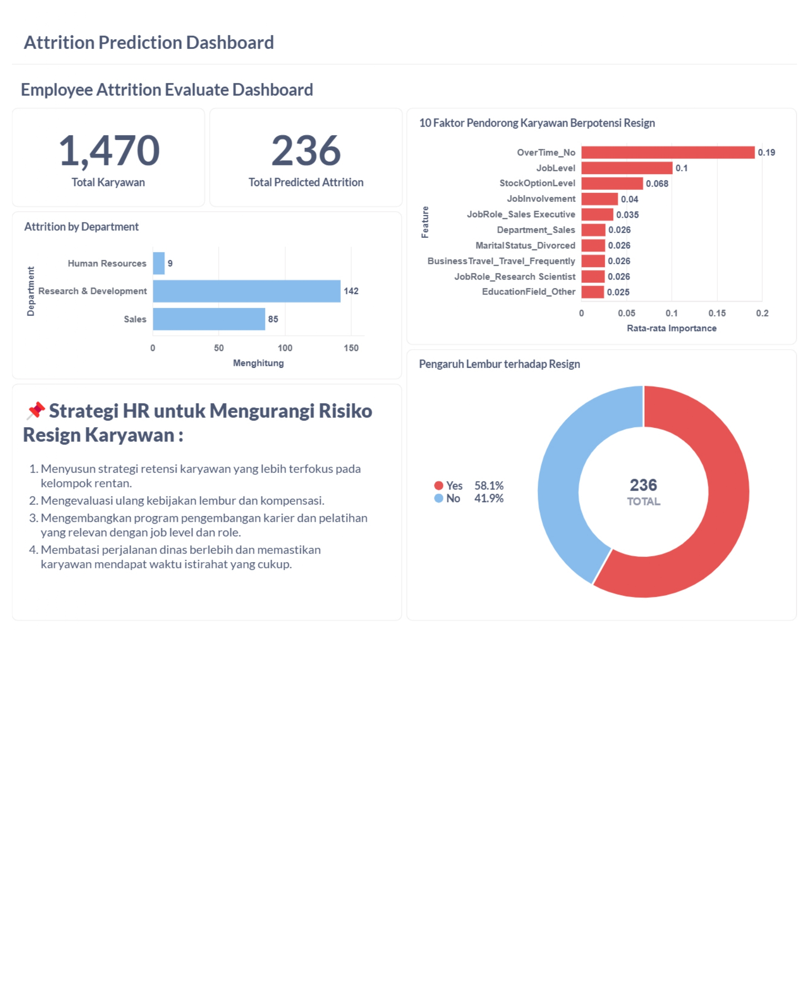

# Proyek Akhir: Menyelesaikan Permasalahan Perusahaan Jaya Jaya Maju

## Business Understanding

> Jaya Jaya Maju merupakan salah satu perusahaan multinasional yang telah berdiri sejak tahun 2000. Ia memiliki lebih dari 1000 karyawan yang tersebar di seluruh penjuru negeri. Walaupun telah menjadi menjadi perusahaan yang cukup besar, Jaya Jaya Maju masih cukup kesulitan dalam mengelola karyawan. Hal ini berimbas tingginya attrition rate (rasio jumlah karyawan yang keluar dengan total karyawan keseluruhan) hingga lebih dari 10%. Tingginya tingkat pengunduran diri (attrition) menyebabkan gangguan operasional dan biaya perekrutan ulang yang tinggi. Untuk itu, dibutuhkan pendekatan prediktif berbasis data untuk mengidentifikasi karyawan yang berpotensi resign, sehingga HRD dapat mengambil tindakan preventif.

### Permasalahan Bisnis

Permasalahan yang ingin diselesaikan antara lain:
- Mendeteksi secara dini karyawan yang berisiko tinggi untuk resign.
- Mengidentifikasi faktor-faktor utama penyebab pengunduran diri.
- Menyusun strategi retensi berdasarkan data.

### Cakupan Proyek

- Memprediksi kemungkinan karyawan akan resign atau tidak.
- Menggunakan model XGBoost serta teknik SMOTE untuk mengatasi data imbalance.
- Menyajikan visualisasi data melalui Metabase Dashboard.
- Memberikan insight dan rekomendasi kepada perusahaan berdasarkan fitur penting yang memengaruhi attrition.

### Persiapan

Sumber data: Dataset karyawan berisi informasi demografis, pekerjaan, status attrition, dll. yang tersimpan dalam file [**employee_data.csv**](Dataset/employee_data.csv) atau unduh langsung dari [dicoding_dataset](https://github.com/dicodingacademy/dicoding_dataset/blob/main/employee/employee_data.csv).

Setup environment:

## ⚙️Instalasi
Pastikan Anda telah menginstal semua dependensi yang dibutuhkan:
```
pip install -r requirements.txt
```
---
## 🎞️Menjalankan Proyek
1️⃣ Jalankan notebook Jupyter atau Google Colab:
   ```
   jupyter notebook Proyek_Resign_Prediction.ipynb
   ```
2️⃣ Ikuti langkah-langkah di dalam notebook untuk melakukan pelatihan dan evaluasi model XGBoost.

3️⃣ Simpan model XGBoost yang telah dilatih, atau **jika ingin melewati proses pelatihan model pada tahap no.2** , Anda dapat langsung mengunduh file-file berikut: [xgboost_model.pkl](model/xgboost_model.pkl), [pipeline.pkl](others/pipeline.pkl), [optimal_threshold.json](others/optimal_threshold.json), dan [top_10_feature_importance.csv](others/top_10_feature_importance.csv).

- ```xgboost_model.pkl:``` berisi model XGBoost yang telah dilatih untuk memprediksi karyawan yang berpotensi resign.
- ```pipeline.pkl:``` berisi preprocessing pipeline (seperti encoding dan scaling) yang diperlukan sebelum model melakukan prediksi.
- ```optimal_threshold.json:``` menyimpan nilai threshold optimal (yaitu **0.28**) yang digunakan untuk mengubah probabilitas prediksi menjadi kelas akhir (resign(1) atau tidak/bertahan(0).
- ```top_10_feature_importance.csv:``` berisi daftar 10 fitur paling berpengaruh terhadap prediksi resign, yang berguna untuk memahami faktor-faktor utama yang mempengaruhi attrition.

File-file ini diperlukan untuk menjalankan [prediction.py](Predict/predict.py) tanpa perlu melatih ulang model.

4️⃣ Selanjutnya jalankan file [prediction.py](Predict/predict.py) atau **jika ingin melewati tahap ini**, Anda dapat langsung mengunduh file [hasil prediksi](Predict/predictions.csv). Berikut penjelasan mengenai tahapan dalam file tersebut:

### **📄 Penjelasan Proses dalam prediction.py:**
```
1. Import Library
- Mengimpor library yang diperlukan untuk pemrosesan data, pemuatan model, dan prediksi.

2. Load Model dan File Terkait
- pipeline.pkl: untuk preprocessing data (seperti encoding dan scaling).
- xgboost_model.pkl: model XGBoost yang sudah dilatih untuk memprediksi apakah karyawan akan resign.
- optimal_threshold.json: nilai threshold optimal (0.28) untuk mengubah probabilitas menjadi label prediksi (0 = bertahan, 1 = resign).

3. Load Data Karyawan
Membaca file employee_data.csv yang berisi data karyawan yang ingin diprediksi. Jika kolom Attrition ada, akan dihapus agar tidak mengganggu proses prediksi.

4. Preprocessing Data
Data karyawan diproses menggunakan pipeline yang sama dengan saat pelatihan model.

5. Prediksi
- Model menghasilkan probabilitas kemungkinan karyawan resign.
- Probabilitas tersebut dikonversi menjadi label biner berdasarkan threshold (0.28).

6. Hasil Prediksi
- Kolom baru ditambahkan ke DataFrame:
- Attrition_Predicted: hasil prediksi apakah karyawan akan resign.
- Probability: probabilitas prediksi dari model.

7. Simpan Hasil
Hasil akhir disimpan ke file predictions.csv.
```

## 🎯Business Dashboard

**Dashboard disusun secara berurutan untuk memberikan narasi yang jelas:**

1. Jumlah Total Karyawan: Menunjukkan total data sebanyak 1.470 karyawan.
2. Prediksi Resign: Menampilkan jumlah karyawan yang diprediksi resign (236 atau ~16%).
3. Distribusi Resign per Departemen: R&D memiliki jumlah potensi resign terbanyak, diikuti oleh Sales dan Human Resources.
4. Top 10 Faktor Penyebab: Fitur paling berpengaruh adalah status lembur (OverTime), jabatan, keterlibatan kerja, dan kepemilikan saham.
5. Pengaruh Lembur: 58.1% karyawan yang resign merupakan mereka yang melakukan lembur.
6. Strategi Retensi: Disusun berdasarkan insight yang ditemukan dari fitur-fitur penting.

## ✨Menjalankan Dashboard Metabase via Docker 

1️⃣ Konversi File ke Database SQLite

Sebelum digunakan di **Metabase**, file hasil prediksi **[predictions.csv](Predict/predictions.csv)** dan file **[top_10_feature_importance.csv](others/top_10_feature_importance.csv)** dikonversi menjadi database **SQLite (.db)**. Untuk melakukan konversi kedua file menjadi database SQLite, Anda dapat menjalankan kode nya pada file [convert.py](others/convert.py) atau Anda dapat langsung mengunduh file hasil konversi SQLite pada [Database Predicted Resign](Dashboard/predicted_resign.db).

**🔍 Mengapa Menggunakan SQLite?**
- **Kompatibilitas tinggi:** Metabase mendukung SQLite sebagai salah satu data source.
- **Mudah dan ringan:** SQLite tidak memerlukan setup server, cukup file .db saja.
- **Ideal untuk prototipe atau deployment skala kecil** seperti dashboard analitik lokal.
- **Portable:** File SQLite bisa langsung digunakan oleh Metabase tanpa konfigurasi kompleks.

2️⃣ Jalankan Metabase via Docker
- Install Docker Dekstop di situs resmi [Docker](https://docs.docker.com/desktop/setup/install/windows-install/).
- Jalankan Docker Terminal lalu buat folder **metabase-data**:
  
  ```sh
  mkdir ~/metabase-data```

3️⃣ Tambah database SQLite sebagai data source di Metabase

**Cukup upload file [Database Predicted Resign](Dashboard/predicted_resign.db) pada Folder metabase-data, lalu Metabase bisa langsung membaca isi tabel dan membuat dashboard-nya.**

```
mv predicted_resign.db ~/metabase-data/```

4️⃣ Menjalankan layanan Metabase menggunakan Docker Container dan menghubungkan folder lokal sebagai volume.

```
docker run -d -p 3000:3000 -v "C:\Users\ACER NITRO V15\metabase-data:/app/metabase-share" --name metabase metabase/metabase```

**🔍 Penjelasan Kode:**

1. ```docker run:``` perintah untuk menjalankan container baru.
2. ```-d:``` menjalankan container di background (detached mode).
3. ```-p 3000:3000:``` memetakan **port 3000** di komputer host ke port 3000 di dalam container (Metabase secara default berjalan di port 3000).
4. ```-v "C:\Users\ACER_NITRO_V15\metabase-data:/app/metabase-share":```
   
   Menghubungkan folder lokal **(C:\Users\...)** ke folder di dalam container **(/app/metabase-share)** agar dapat berbagi file, seperti database SQLite .db.
5. ```--name metabase:``` memberi nama container sebagai metabase.
6. ```metabase/metabase:``` image resmi Metabase dari Docker Hub.

5️⃣ Akses database melalui browser **```http://localhost:3000/```** lalu buat akun admin, contoh (Username : Tsamarah Abdullah, Pass : Tsamarah192), Atau Anda dapat langsung mengakses Dashboard Attrition  dan **Menonton video penjelasan** mengenai [Dashboard Attrition](https://drive.google.com/file/d/1VFefB3yNIc9WjwPRx2zU5EbrNWxRFPAs/view?usp=sharing).


## 📌Conclusion

---
Berdasarkan hasil evaluasi feature importance dari model XGBoost yang telah dioptimalkan, ditemukan bahwa beberapa fitur memiliki kontribusi signifikan terhadap keputusan model dalam memprediksi kemungkinan karyawan melakukan attrition (resign).
---

**✅ Fitur Paling Berpengaruh:**

1️⃣ OverTime_No
> Merupakan fitur paling dominan dengan skor importance tertinggi. Hal ini menunjukkan bahwa status lembur sangat memengaruhi prediksi. Karyawan yang tidak melakukan lembur menunjukkan pola yang berbeda, yang berpotensi berkaitan dengan keterlibatan atau beban kerja yang lebih rendah.

2️⃣ JobLevel dan StockOptionLevel
> Mewakili posisi jabatan dan insentif kepemilikan saham. Karyawan dengan jabatan rendah atau tanpa insentif saham cenderung memiliki risiko lebih tinggi untuk resign, karena keterikatan dan kompensasi yang lebih rendah.

3️⃣ JobInvolvement dan JobRole_Sales Executive
> Tingkat keterlibatan kerja serta jenis pekerjaan sebagai Sales Executive berperan penting. Karyawan dengan keterlibatan rendah atau peran yang memiliki target tinggi cenderung mengalami tekanan lebih besar, yang dapat memengaruhi loyalitas mereka terhadap perusahaan.

**⚖️ Fitur Lain yang Signifikan:**

1️⃣ Department_Sales, MaritalStatus_Divorced, dan BusinessTravel_Travel_Frequently
> Fitur-fitur ini mencerminkan aspek lingkungan kerja, kondisi pribadi, dan mobilitas kerja. Karyawan di departemen sales, berstatus cerai, atau yang sering melakukan perjalanan dinas memiliki kecenderungan lebih tinggi untuk resign.

2️⃣ JobRole_Research Scientist dan EducationField_Other
> Jenis pekerjaan dan latar belakang pendidikan tertentu juga memberikan pengaruh, menunjukkan bahwa profesi berbasis riset atau pendidikan non-umum dapat memiliki dinamika karier yang berbeda dibandingkan peran lainnya.

**👥 Karakteristik Umum Karyawan yang Berpotensi Resign:**

Berdasarkan model prediktif, karyawan yang berisiko tinggi untuk resign cenderung memiliki karakteristik berikut:

1️⃣ Status lembur. Dari total 236 karyawan yang diprediksi akan resign, sebanyak **58,1%** di antaranya menunjukkan keterkaitan dengan status **lembur** sebagai faktor utama yang memengaruhi keputusan resign.

2️⃣ Memiliki level jabatan dan insentif saham yang rendah

3️⃣ Keterlibatan kerja yang rendah

4️⃣ Berasal dari departemen sales, departemen Research & Development, dan departemen Human Resources

5️⃣ Sering melakukan perjalanan bisnis

6️⃣ Status Pernikahan, Misal : Berstatus cerai

7️⃣ Memiliki pekerjaan dengan tekanan target tinggi (misalnya Sales Executive)

**📌 Kesimpulan dan Rekomendasi Strategis**

> Proyek ini berhasil mengidentifikasi potensi attrition menggunakan model machine learning (XGBoost dengan SMOTE), mencapai akurasi hingga **92%**, serta mengoptimalkan **threshold** prediksi untuk hasil yang lebih akurat.

**Model menunjukkan bahwa keputusan resign sangat dipengaruhi oleh kombinasi faktor pekerjaan (lembur, jabatan, keterlibatan) dan faktor personal (status perkawinan, mobilitas kerja, latar belakang pendidikan).**

### Rekomendasi Action Items (Optional)

**✅ Berikut beberapa langkah strategis yang dapat dilakukan HR:**

1️⃣ Evaluasi Kebijakan Lembur dan pemberian insentif

Kurangi lembur berlebihan dan atur keseimbangan kerja-hidup yang sehat.

2️⃣ Mengembangkan program pengembangan karier dan pelatihan berbasis jabatan dan peran kerja

Optimalkan stock option dan jenjang karier agar karyawan lebih termotivasi.

3️⃣ Tingkatkan Keterlibatan Karyawan

Lakukan survei rutin dan kegiatan peningkatan engagement.

4️⃣ Perhatikan Departemen Rawan Resign

Fokus pada R&D, Sales, dan HR untuk program retensi karyawan.

5️⃣ Terapkan Sistem Peringatan Dini

Gunakan dashboard sebagai alat pemantauan rutin untuk mendeteksi risiko resign.
